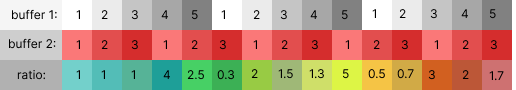

# lightning


Before I ever created a lightning storm, I was simply interested in circular buffers. Circular Buffers are data structrues where you can keep polling the next value without ever running out, because when you get to the end of the buffer, you simply jump back to the beginning. I designed a circular buffer where each successive poll increments the value by one. The circular buffer will go from it's starting point and maxmium point. There are only two methods, one which polls the next value, and one which resets the buffer by sending the value back to its starting value. 

```processing
class circularBuffer{
  int max;
  int val;
  int start;
  
  circularBuffer(int start, int max){
    this.max = max;
    this.start = start;
    val = start;
  }
  
  void sendToStart(){
    val = start;
  }
  
  int next(){
    int valToReturn = val;
    if (val == max) {
      val = start;
    }else{
       val += 1;
     }
    return valToReturn;
  }
}
```
I was interested in using these circular buffers to find rate of changes and visualize functions with them. Using one circular buffer would for example have a rate of change of 1, then a rate of change of 2, then rate of change of 3 ect.  (This would actually just create a quadratic function)


I didn't find this interesting enough so I instead opted to create rates of change by simultaneously polling from two circular buffers and then taking their ratio. 

Ex. for a circular buffer of length 3 and one of length 5



I decided to create a new data structure called a rateOfChangeBuffer. It acts very similarly to my previous circularBuffer. However it is desgined to return the subsequent ratios between polling two circularBuffers. This is possible because polling circularBuffers and taking their ratio is guarnteed to be cyclical, specifically the cycle length is the least common multiple of the lengths of each circularBuffer. 

Like the circularBuffer, the rateOfChangeBuffer has a max value (called max), a current value (called currentIndex), and an implicit start point at 0. Unlike the circularBuffer, rateOfChangeBuffer also has an array of floats. The array is of size max + 1 (so that each value currentIndex can index into changes)
```processing
int max;
int currentIndex = 0;
float[] changes;
```

The constructor for rateOfChangeBuffer takes two circularBuffers: cb1 and cb2 as well as their sizes i and j respectively. The length of the new changes array is determined using i and j. The changes array is then populated by polling the cb1 and cb2 circularBuffers.
```processing
rateOfChangeBuffer(int i, int j, circularBuffer cb1, circularBuffer cb2){
    int arrayLength = lcm(i, j);
    changes = new float[arrayLength];
    for (int z = 0; z < arrayLength; z++) {
        changes[z] = cb1.next() / cb2.next();
    }
    max = arrayLength - 1;
 }
```

Now that the rateOfChangeBuffer data structure is complete, we will create a new class called lightningStorm, as the end result resembles a dense lightning storm. Each lightningStorm has a variable called stormSize. It will also have a 2D-Array (called storm) of rateOfChange buffers both of length stormSize. As well as two arrays of circularBuffers (called buffersOne and buffersTwo), each of length stormSize. 
```processing
class lightningStorm {
  int stormLength = 15;
  rateOfChangeBuffer[][] storm;
  circularBuffer[] buffersOne;
  circularBuffer[] buffersTwo;
 
  
lightningStorm(){
    buffersOne = new circularBuffer[stormLength];
    buffersTwo = new circularBuffer[stormLength];
  
    for(int i = 0; i < stormLength; i++){
      buffersOne[i] = new circularBuffer(1, i + 1);
      buffersTwo[i] = new circularBuffer(1, i + 1);
    }
    storm = new rateOfChangeBuffer[stormLength][stormLength];
```

We can now populate storm by utilizing the rateOfChangeBuffer constructor. The storm will have rateOfChange buffers based on every possible combination of every circularBuffer from size 1 to stormLength. 
```processing
for (int i = 0; i < stormLength; i++) {
        for (int j = 0; j < stormLength; j++) {
            buffersOne[i].sendToStart();
            buffersTwo[i].sendToStart();
            storm[i][j] = new rateOfChangeBuffer(i + 1, j + 1, buffersOne[i], buffersTwo[j]);
        }
    }
 }
```
