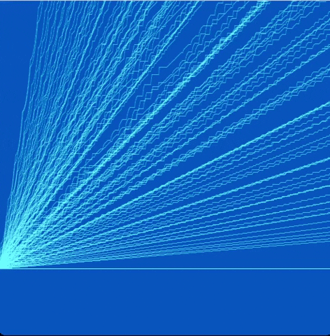

# lightning


Before I ever created a lightning storm, I was simply interested in circular buffers. Circular Buffers are data structrues where you can keep polling the next value without ever running out, because when you get to the end of the buffer, you simply jump back to the beginning. I designed a circular buffer where each successive poll increments the value by one. The circular buffer will go from it's starting point and maxmium point. There are only two methods, one which polls the next value, and one which resets the buffer by sending the value back to its starting value. 

```processing
class circularBuffer{
  int max;
  int val;
  int start;
  
  circularBuffer(int start, int max){
    this.max = max;
    this.start = start;
    val = start;
  }
  
  void sendToStart(){
    val = start;
  }
  
  int next(){
    int valToReturn = val;
    if (val == max) {
      val = start;
    }else{
       val += 1;
     }
    return valToReturn;
  }
}
```
I was interested in using these circular buffers to find rate of changes and visualize functions with them. Using one circular buffer would for example have a rate of change of 1, then a rate of change of 2, then rate of change of 3 ect.  (This would actually just create a quadratic function)


I didn't find this interesting enough so I instead opted to create rates of change by simultaneously polling from two circular buffers and then taking there ratio. 

Ex. for a circular buffer of length 3 and one of length 5


